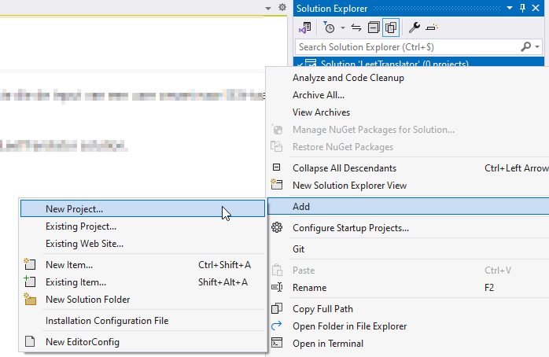
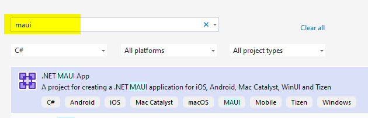
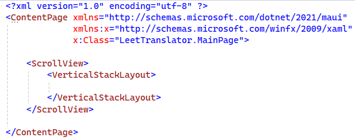
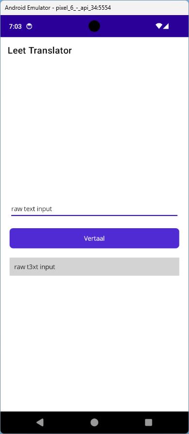
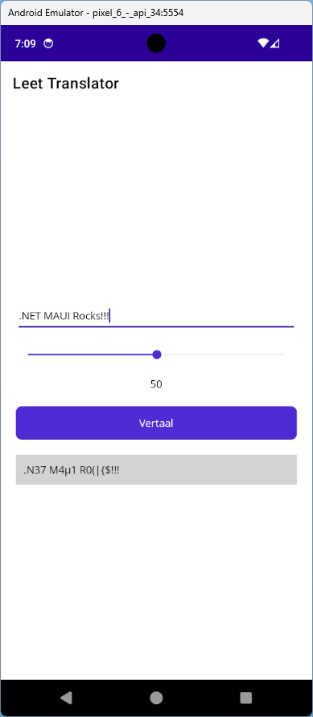

# Leet Translator

In deze opdracht maken we een applicatie die de input van een user omzet naar l33t-taal (https://nl.wikipedia.org/wiki/Leet). 

- Voeg een nieuw project toe aan de LeetTranslator solution.



- Selecteer de MAUI template



- Wijzig de titel van de pagina naar *Leet Translator*
- Verwijder de content uit de VerticalStackLayout van de MainPage zodat je dit over houdt:



- Geef de VerticalStackLayout de volgende eigenschappen:
    - VerticalOptions: Center 
    - Spacing: 20 
    - Padding: 20
- Voeg de volgende elementen toe aan de VerticalStackLayout met de juiste eigenschappen:
	- Entry: dit is een inputveld vergelijkbaaar met een text-input in HTML
        - FontSize: 18
        - PlaceHolder: Vul hier een tekst in
	- Button: als de gebruiker hierop klikt zal de tekst vertaald worden
        - FontSize: 18 
	- Label: hierin komt de vertaalde tekst te staan
        - FontSize: 18
        - Padding: 10
        - BackgroundColor: LightGray
- Zorg dat het label en de entry een *name* hebben zodat je ze kan refereren in de code-behind
- Maak een nieuwe klasse aan genaamd *LeetTranslator*, de code hiervoor vind je helemaal onderaan deze opgave
- De functie *ToLeet()* zorgt ervoor dat een ingegeven tekst vertaald kan worden:
    - Zorg dat de functie wordt opgeroepen als de gebruiker op de knop klikt
    - Haal in *click* event procedure de tekst op uit de entry
    - Vertaal deze string met behump van een instantie van de *LeetTranslator* klasse
    - Plaats de vertaalde tekst in het label

## Extra
- Voeg een slider toe die het niveau van vertalen aangeeft. De functie ToLeet heeft  een tweede (optionele) parameter waarmee je kan aangeven op welk niveau de vertaling moet gebeuren. 
- In de *click* event procedure vraag je de waarde van de slider op (een waarde tussen 0 en 100) en je geeft deze mee aan de functie
- Toon tegelijk de waarde van de slider in een nieuw label telkens wanneer de waarde van de slider wijzigt

 

**LeetTranslator.cs:**
```
public class LeetTranslator
{
    public string ToLeet(string raw, double degree = 10)
    {
        if (string.IsNullOrWhiteSpace(raw))
            return ToLeet("Please fill in something");

        var sb = new StringBuilder();
        foreach (var c in raw)
        {
            #region Degree < 17
            if (degree < 17)
            {
                switch (c)
                {
                    case 'e': sb.Append("3"); break;
                    case 'E': sb.Append("3"); break;
                    default: sb.Append(c); break;
                }
            }
            #endregion
            #region Degree > 16 and < 33
            else if (degree < 33 && degree > 16)
            {
                switch (c)
                {
                    case 'a': sb.Append("4"); break;
                    case 'e': sb.Append("3"); break;
                    case 'i': sb.Append("1"); break;
                    case 'o': sb.Append("0"); break;
                    case 'A': sb.Append("4"); break;
                    case 'E': sb.Append("3"); break;
                    case 'I': sb.Append("1"); break;
                    case 'O': sb.Append("0"); break;
                    default: sb.Append(c); break;
                }
            }
            #endregion
            #region Degree > 32 and < 49
            else if (degree < 49 && degree > 32)
            {
                switch (c)
                {
                    case 'a': sb.Append("4"); break;
                    case 'e': sb.Append("3"); break;
                    case 'i': sb.Append("1"); break;
                    case 'o': sb.Append("0"); break;
                    case 'A': sb.Append("4"); break;
                    case 'E': sb.Append("3"); break;
                    case 'I': sb.Append("1"); break;
                    case 'O': sb.Append("0"); break;
                    case 's': sb.Append("$"); break;
                    case 'S': sb.Append("$"); break;
                    case 'l': sb.Append("£"); break;
                    case 'L': sb.Append("£"); break;
                    case 'c': sb.Append("("); break;
                    case 'C': sb.Append("("); break;
                    case 'y': sb.Append("¥"); break;
                    case 'Y': sb.Append("¥"); break;
                    case 'u': sb.Append("µ"); break;
                    case 'U': sb.Append("µ"); break;
                    case 'd': sb.Append("Ð"); break;
                    case 'D': sb.Append("Ð"); break;
                    default: sb.Append(c); break;
                }
            }
            #endregion
            #region Degree > 48 and < 65
            else if (degree < 65 && degree > 48)
            {
                switch (c)
                {
                    case 'a': sb.Append("4"); break;
                    case 'e': sb.Append("3"); break;
                    case 'i': sb.Append("1"); break;
                    case 'o': sb.Append("0"); break;
                    case 'A': sb.Append("4"); break;
                    case 'E': sb.Append("3"); break;
                    case 'I': sb.Append("1"); break;
                    case 'O': sb.Append("0"); break;
                    case 'k': sb.Append("|{"); break;
                    case 'K': sb.Append("|{"); break;
                    case 's': sb.Append("$"); break;
                    case 'S': sb.Append("$"); break;
                    case 'g': sb.Append("9"); break;
                    case 'G': sb.Append("9"); break;
                    case 'l': sb.Append("£"); break;
                    case 'L': sb.Append("£"); break;
                    case 'c': sb.Append("("); break;
                    case 'C': sb.Append("("); break;
                    case 't': sb.Append("7"); break;
                    case 'T': sb.Append("7"); break;
                    case 'z': sb.Append("2"); break;
                    case 'Z': sb.Append("2"); break;
                    case 'y': sb.Append("¥"); break;
                    case 'Y': sb.Append("¥"); break;
                    case 'u': sb.Append("µ"); break;
                    case 'U': sb.Append("µ"); break;
                    case 'f': sb.Append("ƒ"); break;
                    case 'F': sb.Append("ƒ"); break;
                    case 'd': sb.Append("Ð"); break;
                    case 'D': sb.Append("Ð"); break;
                    default: sb.Append(c); break;
                }
            }
            #endregion
            #region Degree > 64 and < 81
            else if (degree < 81 && degree > 64)
            {
                switch (c)
                {
                    case 'a': sb.Append("4"); break;
                    case 'e': sb.Append("3"); break;
                    case 'i': sb.Append("1"); break;
                    case 'o': sb.Append("0"); break;
                    case 'A': sb.Append("4"); break;
                    case 'E': sb.Append("3"); break;
                    case 'I': sb.Append("1"); break;
                    case 'O': sb.Append("0"); break;
                    case 'k': sb.Append("|{"); break;
                    case 'K': sb.Append("|{"); break;
                    case 's': sb.Append("$"); break;
                    case 'S': sb.Append("$"); break;
                    case 'g': sb.Append("9"); break;
                    case 'G': sb.Append("9"); break;
                    case 'l': sb.Append("£"); break;
                    case 'L': sb.Append("£"); break;
                    case 'c': sb.Append("("); break;
                    case 'C': sb.Append("("); break;
                    case 't': sb.Append("7"); break;
                    case 'T': sb.Append("7"); break;
                    case 'z': sb.Append("2"); break;
                    case 'Z': sb.Append("2"); break;
                    case 'y': sb.Append("¥"); break;
                    case 'Y': sb.Append("¥"); break;
                    case 'u': sb.Append("µ"); break;
                    case 'U': sb.Append("µ"); break;
                    case 'f': sb.Append("ƒ"); break;
                    case 'F': sb.Append("ƒ"); break;
                    case 'd': sb.Append("Ð"); break;
                    case 'D': sb.Append("Ð"); break;
                    case 'n': sb.Append("|\\|"); break;
                    case 'N': sb.Append("|\\|"); break;
                    case 'w': sb.Append("\\/\\/"); break;
                    case 'W': sb.Append("\\/\\/"); break;
                    case 'h': sb.Append("|-|"); break;
                    case 'H': sb.Append("|-|"); break;
                    case 'v': sb.Append("\\/"); break;
                    case 'V': sb.Append("\\/"); break;
                    case 'm': sb.Append("|\\/|"); break;
                    case 'M': sb.Append("|\\/|"); break;
                    default: sb.Append(c); break;
                }
            }
            #endregion
            #region Degree < 100 and > 80
            else if (degree > 80 && degree < 100)
            {
                switch (c)
                {
                    case 'a': sb.Append("4"); break;
                    case 'e': sb.Append("3"); break;
                    case 'i': sb.Append("1"); break;
                    case 'o': sb.Append("0"); break;
                    case 'A': sb.Append("4"); break;
                    case 'E': sb.Append("3"); break;
                    case 'I': sb.Append("1"); break;
                    case 'O': sb.Append("0"); break;
                    case 's': sb.Append("$"); break;
                    case 'S': sb.Append("$"); break;
                    case 'g': sb.Append("9"); break;
                    case 'G': sb.Append("9"); break;
                    case 'l': sb.Append("£"); break;
                    case 'L': sb.Append("£"); break;
                    case 'c': sb.Append("("); break;
                    case 'C': sb.Append("("); break;
                    case 't': sb.Append("7"); break;
                    case 'T': sb.Append("7"); break;
                    case 'z': sb.Append("2"); break;
                    case 'Z': sb.Append("2"); break;
                    case 'y': sb.Append("¥"); break;
                    case 'Y': sb.Append("¥"); break;
                    case 'u': sb.Append("µ"); break;
                    case 'U': sb.Append("µ"); break;
                    case 'f': sb.Append("ƒ"); break;
                    case 'F': sb.Append("ƒ"); break;
                    case 'd': sb.Append("Ð"); break;
                    case 'D': sb.Append("Ð"); break;
                    case 'n': sb.Append("|\\|"); break;
                    case 'N': sb.Append("|\\|"); break;
                    case 'w': sb.Append("\\/\\/"); break;
                    case 'W': sb.Append("\\/\\/"); break;
                    case 'h': sb.Append("|-|"); break;
                    case 'H': sb.Append("|-|"); break;
                    case 'v': sb.Append("\\/"); break;
                    case 'V': sb.Append("\\/"); break;
                    case 'k': sb.Append("|{"); break;
                    case 'K': sb.Append("|{"); break;
                    case 'r': sb.Append("®"); break;
                    case 'R': sb.Append("®"); break;
                    case 'm': sb.Append("|\\/|"); break;
                    case 'M': sb.Append("|\\/|"); break;
                    case 'b': sb.Append("ß"); break;
                    case 'B': sb.Append("ß"); break;
                    case 'q': sb.Append("Q"); break;
                    case 'Q': sb.Append("Q¸"); break;
                    case 'x': sb.Append(")("); break;
                    case 'X': sb.Append(")("); break;
                    default: sb.Append(c); break;
                }
            }
            #endregion
            #region Degree 100
            else if (degree > 99)
            {
                switch (c)
                {
                    case 'a': sb.Append("4"); break;
                    case 'e': sb.Append("3"); break;
                    case 'i': sb.Append("1"); break;
                    case 'o': sb.Append("0"); break;
                    case 'A': sb.Append("4"); break;
                    case 'E': sb.Append("3"); break;
                    case 'I': sb.Append("1"); break;
                    case 'O': sb.Append("0"); break;
                    case 's': sb.Append("$"); break;
                    case 'S': sb.Append("$"); break;
                    case 'g': sb.Append("9"); break;
                    case 'G': sb.Append("9"); break;
                    case 'l': sb.Append("£"); break;
                    case 'L': sb.Append("£"); break;
                    case 'c': sb.Append("("); break;
                    case 'C': sb.Append("("); break;
                    case 't': sb.Append("7"); break;
                    case 'T': sb.Append("7"); break;
                    case 'z': sb.Append("2"); break;
                    case 'Z': sb.Append("2"); break;
                    case 'y': sb.Append("¥"); break;
                    case 'Y': sb.Append("¥"); break;
                    case 'u': sb.Append("µ"); break;
                    case 'U': sb.Append("µ"); break;
                    case 'f': sb.Append("ƒ"); break;
                    case 'F': sb.Append("ƒ"); break;
                    case 'd': sb.Append("Ð"); break;
                    case 'D': sb.Append("Ð"); break;
                    case 'n': sb.Append("|\\|"); break;
                    case 'N': sb.Append("|\\|"); break;
                    case 'w': sb.Append("\\/\\/"); break;
                    case 'W': sb.Append("\\/\\/"); break;
                    case 'h': sb.Append("|-|"); break;
                    case 'H': sb.Append("|-|"); break;
                    case 'v': sb.Append("\\/"); break;
                    case 'V': sb.Append("\\/"); break;
                    case 'k': sb.Append("|{"); break;
                    case 'K': sb.Append("|{"); break;
                    case 'r': sb.Append("®"); break;
                    case 'R': sb.Append("®"); break;
                    case 'm': sb.Append("|\\/|"); break;
                    case 'M': sb.Append("|\\/|"); break;
                    case 'b': sb.Append("ß"); break;
                    case 'B': sb.Append("ß"); break;
                    case 'j': sb.Append("_|"); break;
                    case 'J': sb.Append("_|"); break;
                    case 'P': sb.Append("|°"); break;
                    case 'q': sb.Append("¶"); break;
                    case 'Q': sb.Append("¶¸"); break;
                    case 'x': sb.Append(")("); break;
                    case 'X': sb.Append(")("); break;
                    default: sb.Append(c); break;
                }
            }
            #endregion

        }
        return sb.ToString();
    }
}
```
